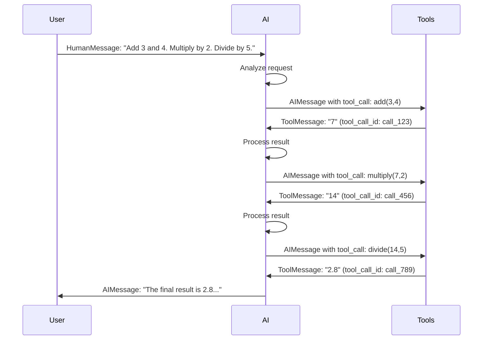

# LangChain Message Types

This document explains the different message types in LangChain and their roles in building AI applications.

## Message Type Hierarchy

LangChain uses a hierarchical message system where all messages inherit from `BaseMessage`. Each message type serves a specific purpose in the conversation flow.

### Message Types Overview

| Message Type | Parent Class | Purpose | Key Attributes |
|--------------|--------------|---------|----------------|
| **BaseMessage** | None | Abstract base class for all messages | `content`, `additional_kwargs` |
| **HumanMessage** | BaseMessage | Represents user input/prompt | `content`, `name` (optional) |
| **AIMessage** | BaseMessage | Represents AI model response | `content`, `tool_calls`, `name` (optional) |
| **ToolMessage** | BaseMessage | Represents tool execution result | `content`, `tool_call_id`, `name` (optional) |

### Detailed Breakdown

#### BaseMessage
- **Abstract class** that all other message types inherit from
- **Common properties**: `content` (string), `additional_kwargs` (dict)
- **Purpose**: Provides consistent interface for all message types

#### HumanMessage
- **Represents**: User input, questions, or prompts
- **Use case**: Starting conversations, providing context, asking questions
- **Example**: "What is the weather in New York?"

#### AIMessage
- **Represents**: AI model's response or decision
- **Capabilities**: Can contain text content and/or tool call instructions
- **Use case**: Responding to queries, deciding to use tools, providing analysis
- **Special features**: Can include `tool_calls` for agent workflows

#### ToolMessage
- **Represents**: Result of tool execution
- **Purpose**: Provides tool output back to the AI model
- **Required**: `tool_call_id` to link with the corresponding AIMessage's tool call
- **Use case**: Returning weather data, calculation results, API responses

## Conversation Flow Example

Here's a complete conversation demonstrating all three message types in action:

### Scenario: Math Calculation Agent

```
User: "Add 3 and 4. Multiply the result by 2. Divide by 5."
```

#### Message Flow:

1. **HumanMessage** (User Input)
   ```
   content: "Add 3 and 4. Multiply the result by 2. Divide by 5."
   ```

2. **AIMessage** (AI Decision - Tool Call)
   ```
   content: "I'll help you with that calculation step by step."
   tool_calls: [
     {
       "id": "call_123",
       "function": {
         "name": "add",
         "arguments": {"a": 3, "b": 4}
       }
     }
   ]
   ```

3. **ToolMessage** (Tool Result)
   ```
   content: "7"
   tool_call_id: "call_123"
   ```

4. **AIMessage** (AI Decision - Next Tool Call)
   ```
   content: "Now I'll multiply the result by 2."
   tool_calls: [
     {
       "id": "call_456",
       "function": {
         "name": "multiply",
         "arguments": {"a": 7, "b": 2}
       }
     }
   ]
   ```

5. **ToolMessage** (Tool Result)
   ```
   content: "14"
   tool_call_id: "call_456"
   ```

6. **AIMessage** (AI Decision - Final Tool Call)
   ```
   content: "Finally, I'll divide by 5."
   tool_calls: [
     {
       "id": "call_789",
       "function": {
         "name": "divide",
         "arguments": {"a": 14, "b": 5}
       }
     }
   ]
   ```

7. **ToolMessage** (Final Tool Result)
   ```
   content: "2.8"
   tool_call_id: "call_789"
   ```

8. **AIMessage** (Final Response)
   ```
   content: "The final result is 2.8. Here's how I got there:
   1. 3 + 4 = 7
   2. 7 × 2 = 14
   3. 14 ÷ 5 = 2.8"
   ```

## Flow Diagram



## Key Patterns

### Agent Workflow Pattern
1. **HumanMessage** → User input
2. **AIMessage** → AI decides to use tools
3. **ToolMessage** → Tool execution result
4. **AIMessage** → AI processes result and decides next action
5. **Repeat** steps 2-4 until task complete
6. **AIMessage** → Final response without tool calls

### Message Passing
- **State Management**: Messages are stored in a list to maintain conversation history
- **Context Preservation**: Each message builds upon previous messages
- **Tool Coordination**: `tool_call_id` links AIMessage tool calls with ToolMessage results

## Best Practices

1. **Clear Content**: Ensure message content is descriptive and clear
2. **Tool Naming**: Use descriptive tool names and parameters
3. **Error Handling**: Include error information in ToolMessage when tools fail
4. **Context Management**: Maintain relevant context in the message history
5. **Tool Call IDs**: Always match `tool_call_id` between AIMessage and ToolMessage

## Implementation Notes

- Messages are immutable once created
- All messages inherit from `BaseMessage` ensuring consistent interface
- Tool messages require explicit linking to their corresponding tool calls
- Message history enables complex multi-step conversations and reasoning